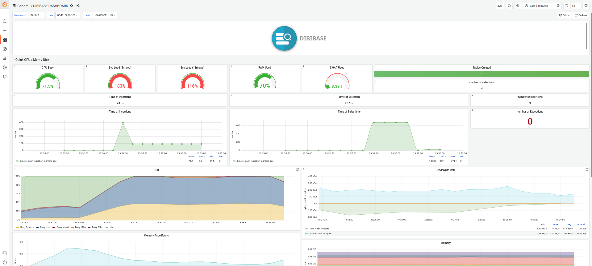
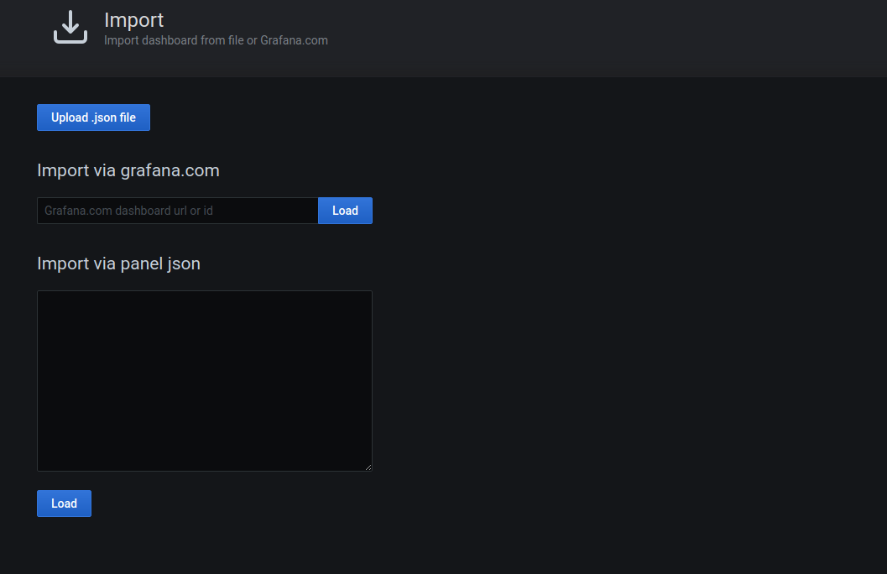

Metric Collection for Dibibase v1.0
# Introduction

Dibibase uses prometheus to scrap all the metrics needed and events to then be shown on Grafana dashboards.

Dibibase exposes port 8080 for metrics collection via prometheus at "/metrics" .

you need to install is Grafana, Prometheus, and node exporter for metric collection and visualization.

# Prometheus Configuration

after installing prometheus head to the installation place (where you unzipped your tar ot whatnot) and replace the *prometheus.yml* file with the one included [/prometheus](/prometheus/).

 Make sure you install and run the node exporter as well.

After running the database, check if **DIBIBASE** target is up and running on prometheus targets page, if not head to `localhost:8080/metrics`   and if there are metrics so there is error in configuration of prometheus with Dibibase and if no metrics are shown then be sure Dibibase is up and running.

# Grafana Setup

After installing prometheus you'll find all Dibibase dashboards located in [/grafana](/grafana/) directory and then back to grafana in order To import a dashboard click Import under the Dashboards icon in the side menu..
make sure to connect to prometheus port (9100) for single node usage, and insert every node port for cluster usage.

 
